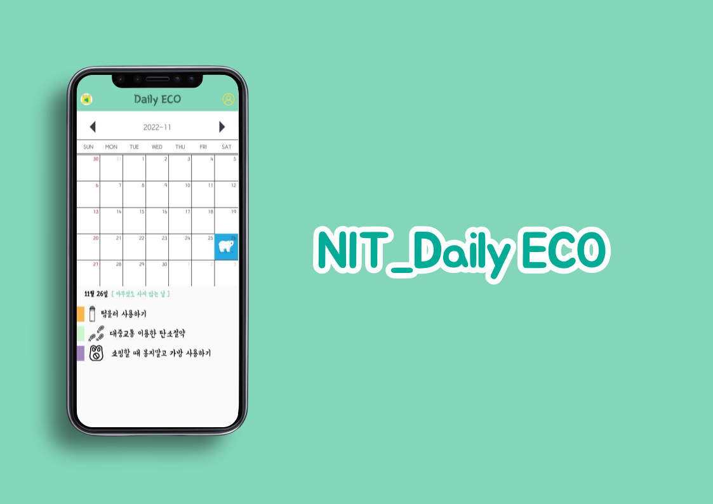
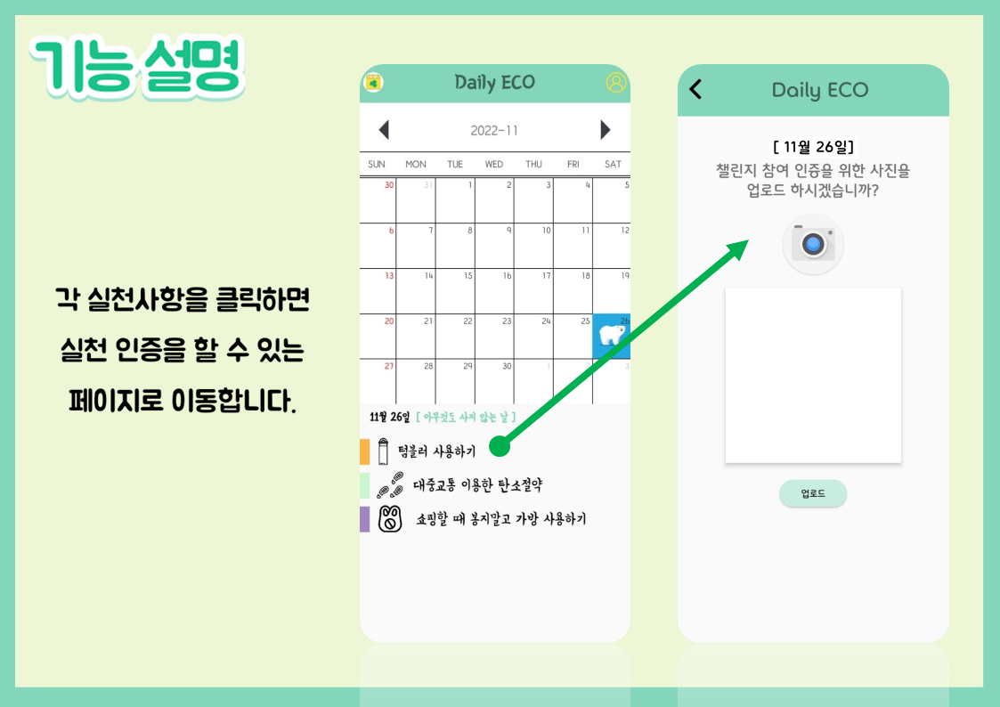
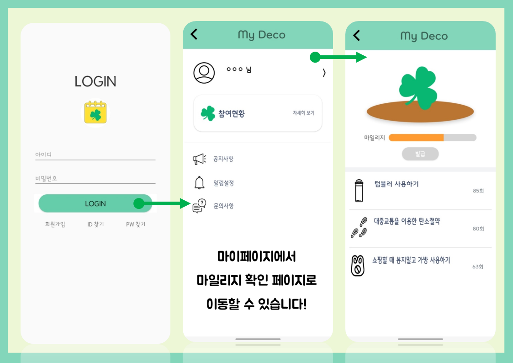
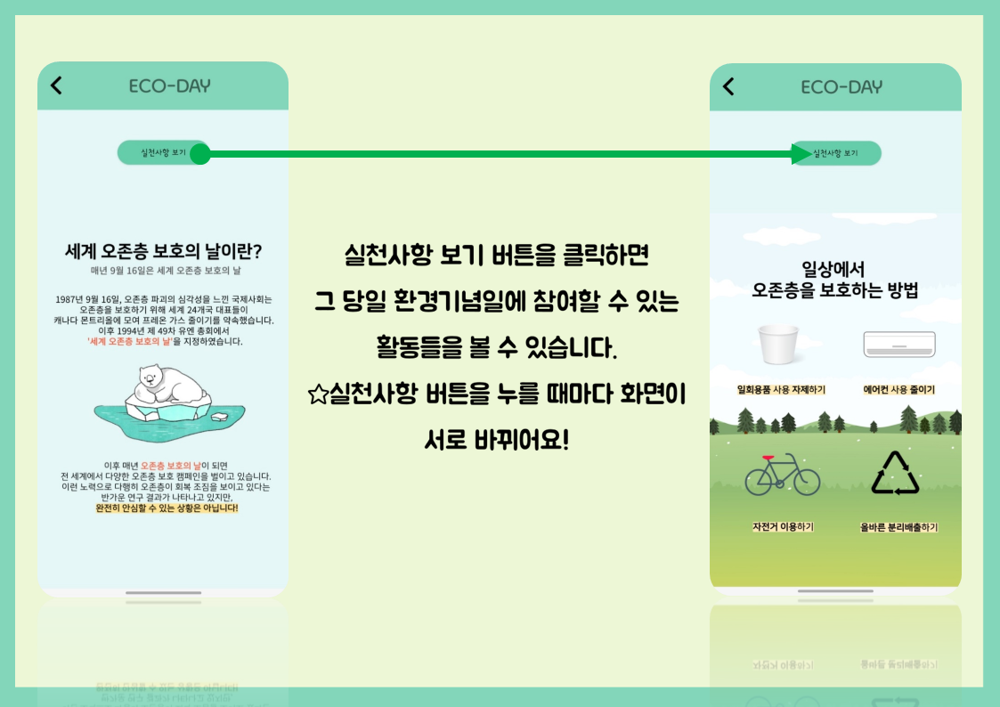

# DailyEco

## 어플개발
</img>
### [layout 코드 보러가기](https://github.com/99qkrtjdus/코드/app/src/main/res/layout)

## 팀원소개
대학동기들과 함께 개발한 어플.
팀장 박서연 / 팀원 최윤아, 백지원, 강희주, 이한빛 5명이 제작.
</img>

## 어플설명
‘데일리 에코’는 환경보호를 위한 일상실천 어플.
꾸준히 이슈가 되고 있는 환경오염에 대해 이야기를 나누게 되었고, ‘환경보호를 위해 무엇이 가장 필요 할까’라는 고민을 해보게 되었다. 
결국 한사람 한사람이 환경오염에 대한 문제를 인식하는 것이 환경보호의 시작이라는 결론을 도출. 
어플을 개발하며 우리가 생각한 목적은 두 가지이다다.
첫째, 환경기념일 알림을 통한 환경오염과 환경문제의 심각성 인지.
둘째, 일상 속 환경보호를 위한 실천 유도
국제환경기구와 다양한 환경단체에서 지정한 환경기념일이 많기에 이를 활용해보고자 했다. 
이 환경기념일 알림 기능을 통해 꾸준히 환경보호에 대한 중요성을 인식할 수 있게 하고
일상속에서 환경보호를 위한 실천을 하면 마일리지를 제공, 일정량을 채우면 친환경 제품을 제공하는 방식으로 실천을 유도하고자 한다.

</img>
- 메인 달력화면에서 실천사항의 각 항목을 누르면 실천인증을 할 수 있는 페이지로 이동. 실천인증 페이지에서 카메라 아이콘을 누르면 사진을 찍을 수 있는 카메라로 들어가고, 여기서 실천한 사항을 사진 찍어 인증하면 된다.

</img>
- 메인 페이지에서 마이페이지 아이콘을 클릭하면 로그인 페이지로 이동. 로그인 후 마이페이지로 이동하며 나의 계정을 확인할 수 있고, 마이페이지에서 참여현황을 누르면 마일리지 확인 페이지로 이동할 수 있다. 마일리지 확인 페이지에서는 실천사항을 얼마나 실천하고 있는지 확인할 수 있으며 마일리지 현황을 확인할 수 있다.

</img>
- 메인 페이지에서 환경기념일 텍스트를 누르면 기념일에 대한 설명을 해주는 페이지로 넘어간다. 실천사항 보기 버튼을 클릭하면 그 당일 환경기념일에 참여할 수 있는 활동들을 볼 수 있다. 위에 버튼을 누를 때마다 화면이 서로 바뀌도록 구현.
